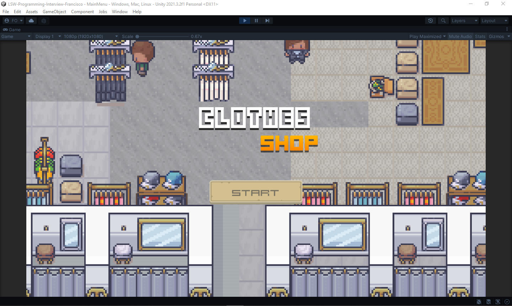
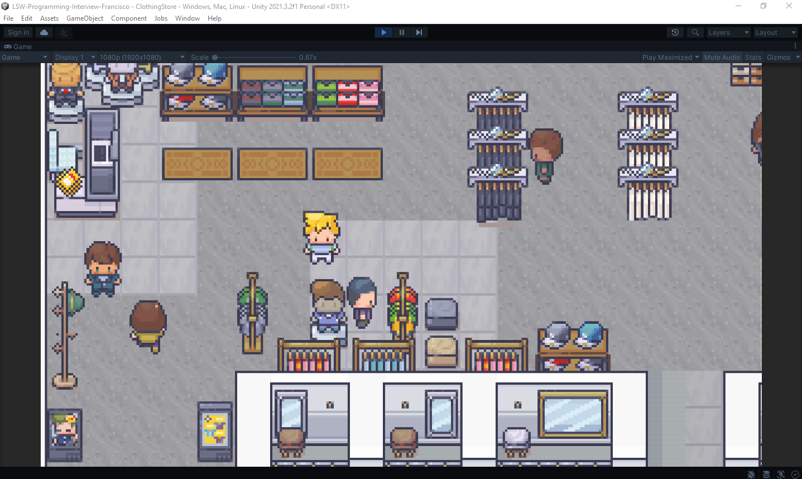
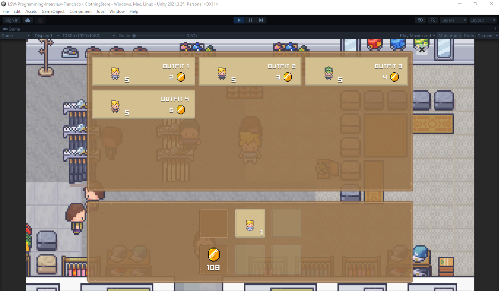
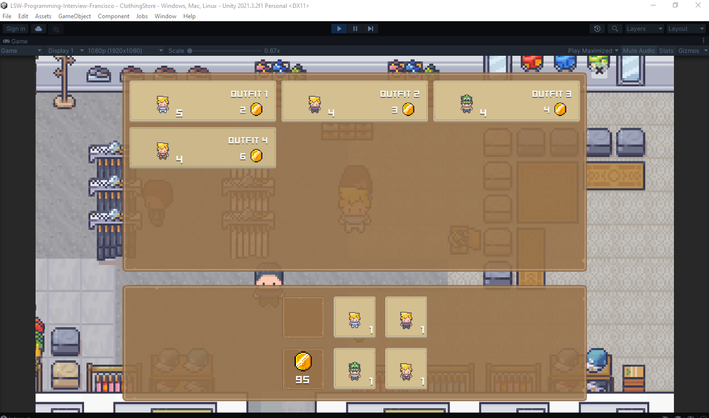
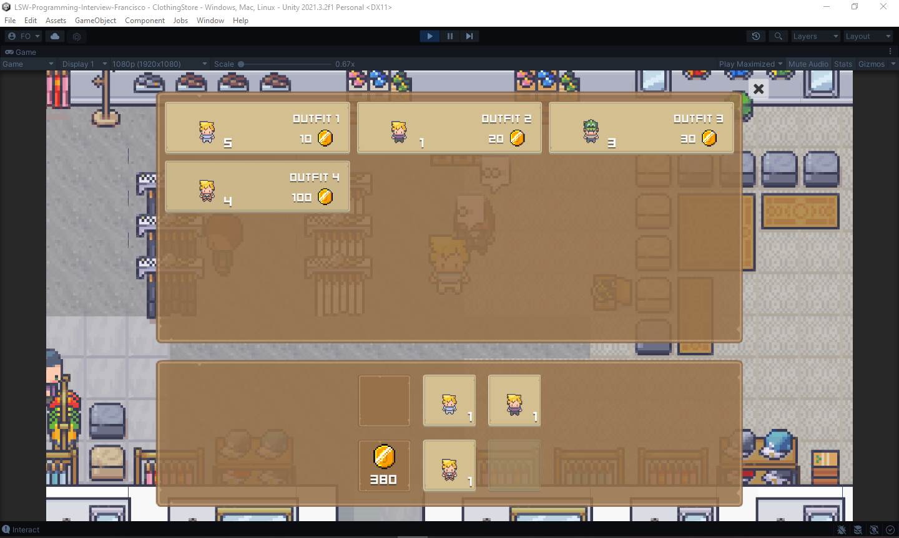
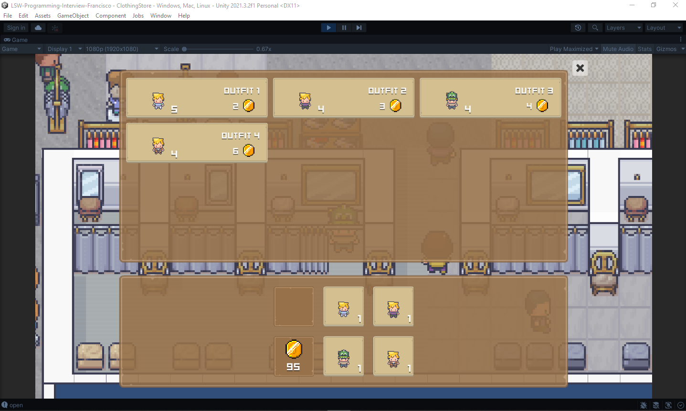
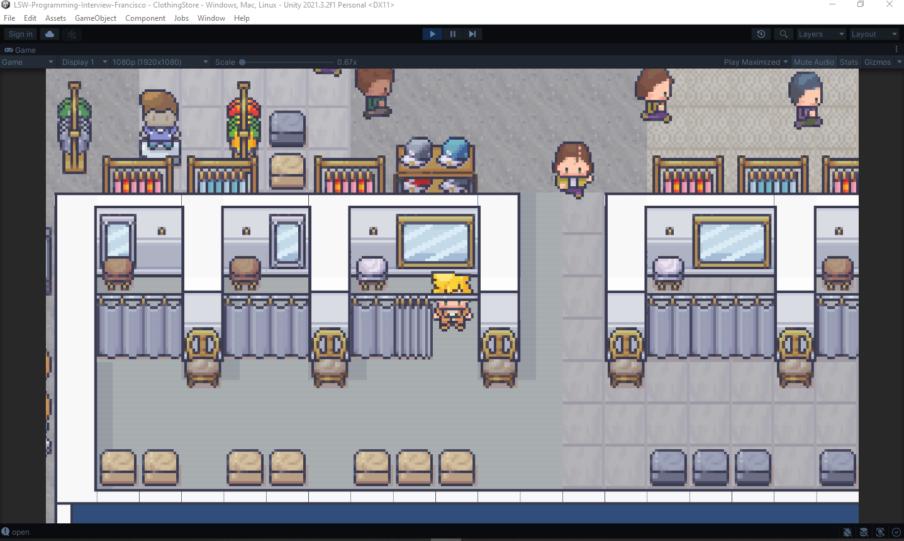

# LSW-Programming-Interview-Francisco

# Walking (WASD)

# Interact (Press E key) 

To interact, press the E key near the shopkeeper or move to the room curtain and the store menu will open.

# Equipping the bought outfits

# Clients simulation

