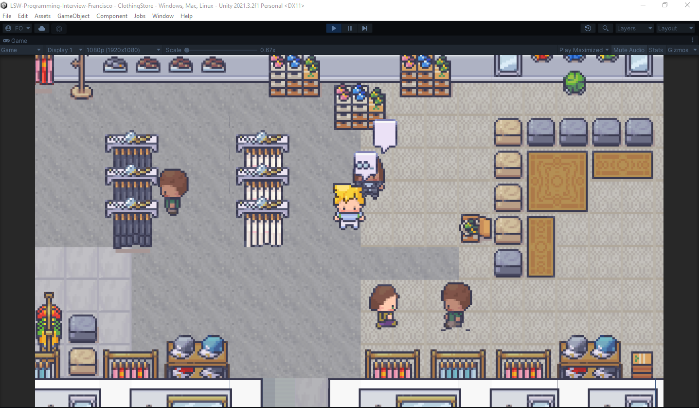

The project include four scenes: 
+ MainMenu 
    ###### Scene dependencies
  - Managers
+ Clothing Store (Main Scene)  
    ###### Scene dependencies
  - Gameplay
  - Managers

+ Gameplay  (Managers releated to the Gameplay)
  - ShopManager (Manager that deals with the shopUI)

+ Managers (Here we can put the generic game managers)
  - SceneLoaderManger (Which is basically the scene loader)
  
 ### Function 
 
+ Player
 
  - Basic player controller walk up, down, left and right
 
  - Interact with shopkeepers (buying/selling items, item icons, item prices as well as equipping the bought outfits)
  - Animations
 
+ Customer
  - Customers spawner
  - Patrolling through a way path
  
+ Package installed
  - ScriptableObject-Architecture (event system based on programmable objects)

# LSW-Programming-Interview-Francisco

# Walking (WASD)

# Interact (Press E key) 

To interact, press the E key near the shopkeeper or move to the room curtain and the shop menu will open.

# Equipping the bought outfits

# Remove outfit from player inventory

# Clients simulation

